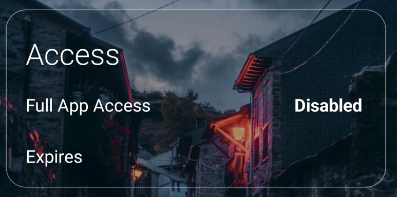

# JoeLauncher

A custom fork of [Olauncher](https://github.com/tanujnotes/Olauncher) — the minimal, ad-free Android launcher.

> For full documentation about the base launcher, visit the [Olauncher GitHub repo](https://github.com/tanujnotes/Olauncher).

---

## What's Different in JoeLauncher?

### 1. Hidden Apps by Default

Only apps pinned to your home screen are visible by default. All other apps are hidden from the app drawer.

You can temporarily enable access to all apps in the settings menu when needed.

<!-- TODO: Add screenshot -->

### 2. Separate Wallpaper Control

Olauncher has a daily wallpaper feature that automatically updates your wallpaper to a new image every day.

JoeLauncher extends this by letting you choose **where** the daily wallpaper is applied:
- **Both** (home screen + lock screen) — original behavior
- **Home screen only**
- **Lock screen only**

---

## Install

Download the APK from the [latest release](https://github.com/yourusername/JoeLauncher/releases/).

---

## License

[GNU GPLv3](https://www.gnu.org/licenses/gpl-3.0.en.html)

Based on [Olauncher](https://github.com/tanujnotes/Olauncher) by [@tanujnotes](https://twitter.com/tanujnotes)
